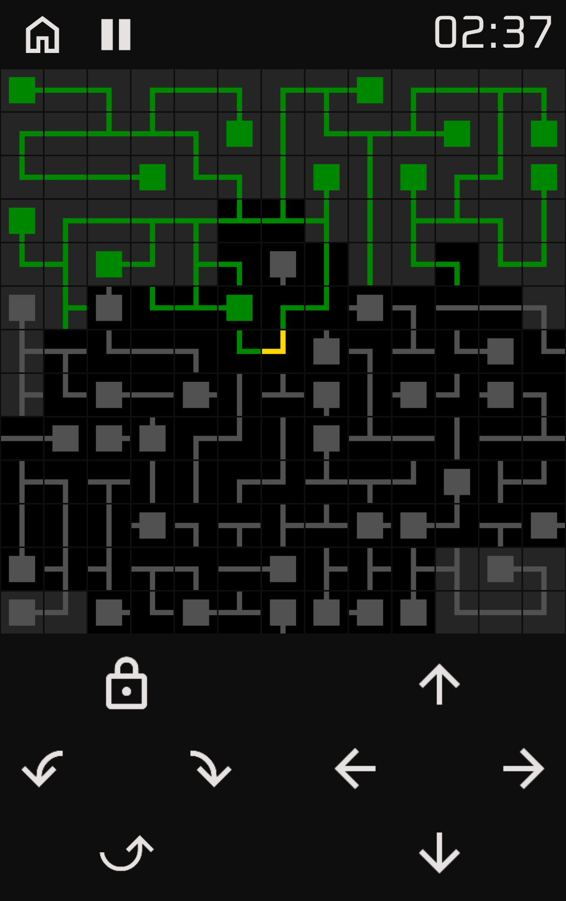

(ENG)

A puzzle game where the goal is to rotate all the pieces so that they are connected to the center gold piece. All piece sides with connectable ends have to be connected.

The game can be played completely offline, but registering an account enables extra features:
- Automatic cloud saving of unsolved boards
- Tracking of the player level and history of all solved boards
- Ability to see your solve times on the global leaderboards
- Ability to share your solved boards on your profile
- User following

---

(HRV)

Puzzle igra u kojoj je cilj rotirati sve kvadratiće(tj. simbole unutar njih) tako da svi budu povezani sa središnjim zlatnim kvadratićem. Sve strane kvadratića sa spojivim krajevima moraju biti spojene.

Igru je moguće igrati potpuno bez internetske veze, ali registracija računa omogućuje dodatne značajke:
- Automatsko spremanje neriješenih ploča u oblak
- Praćenje razine igrača i povijest svih riješenih ploča
- Mogućnost da vidite svoje vrijeme rješavanja na globalnoj ploči s najboljim rezultatima
- Mogućnost dijeljenja vaših riješenih ploča na vašem profilu
- Praćenje korisnika

---

